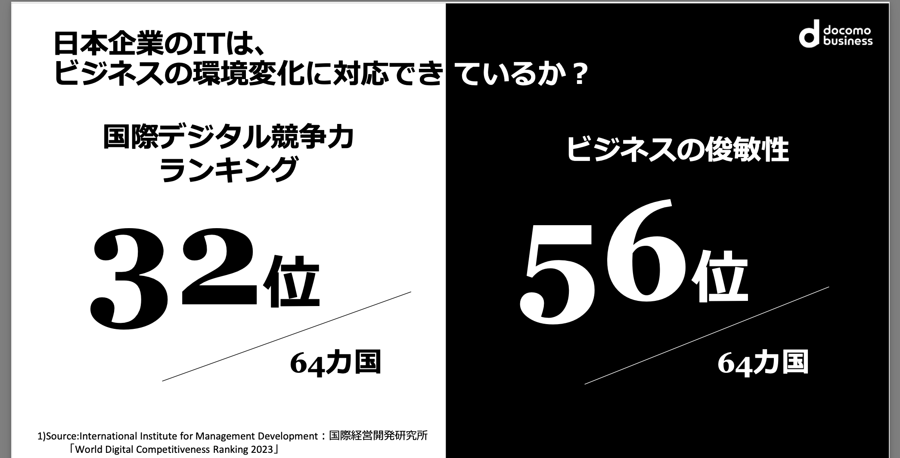

# はじめに

AWS Summit Japan2024が6月 20 日（木）、21 日（金）の二日間に渡り開催されました。現在製造業勤務の私ですが有給をいただき２日目だけ参加して来ました。参加したセッションはブースセッションも合わせて６つです。その中で印象的だったセッションを備忘のためにも記しておきます。

# AWSセッション

## 基調講演(KEY-02)

## 　ビルダーとテクノロジーが加速する次のイノベーション

* スピーカー
  * 東海旅客鉄道株式会社                    水津 亨 様
  * 株式会社電通デジタル                    山本 覚 様
  * Amazon Web Services Inc.            ラフ―ル パサック　様
  * アマゾン ウェブ サービス ジャパン合同会社  巨勢 泰宏　様

* 概要
様々な企業が生成AIによりデータをより戦略的かつ簡単に活用し、差別化やイノベーションを加速している、どの企業も平均２〜３ヶ月という短期間であった。その中で東海旅客鉄道株式会社様と株式会社電通デジタル様がゲストとして活用事例を講演した。

* 所感

とにかく生成AIに力入れて行くぞというメッセージが強く伝わりました。今の自分からは生成AI活用なんてとても遠い話に感じてしまったが、ここに喰らい付いて行く気持ち忘れずにトレンド追いたいと思います。

## Room A (AWS-33)Level 200: 初級者向け

## チームのつながりを Infrastructure as Code でデザインする

* スピーカー
  * アマゾン ウェブ サービス ジャパン合同会社 高野 賢司 様

* 概要

 チームのつながりが不適切だとフローが低下する。IaC(Infrastructure as Code) のプラクティスを組織づくりにどのように活用できるか、5つの障壁とその解決策、チーム設計はストリームアラインドチームについて、インタラクションを適正にするメカニズムをつくるために必要なことなど。

* 所感

スピーカー様のお話が上手であった点もありますが、インフラのコード化がこんなにも役に立てるのか…と聴いていてワクワクするセッションでした。さらにCDKをスキル転換の第一歩にしてチームのインフラエンジニアとアプリエンジニアが相互に学び、協働するとの素敵なお話で、もちろんチームだけでなくチームを支援する仕組みも必要ですが、そんな職場で働けたら…と夢のある講演でした。

CDK学ぼう！素直さは大事。

# パートナーセッション

## Room I (AP‐35) 

## AWS と実現するデジタルイノベーション ～日本企業のデジタル競争力向上に向けて～

* スピーカー
  * NTTコミュニケーションズ株式会社 山下 克典 様

* 概要

2023年の日本企業の国際デジタル競争力とビジネスの俊敏性ランキングを踏まえた上で、迅速にICT環境を最適化し、ビジネスの俊敏性に対応していくかが重要である。そこでModern Managed Platformという新たなマネージドプラットフォーム、AI/MLの活用においてはNTT版LLM「tsuzumi」を用いて、AWSとDXを推進する企業のみなさまと一緒に課題を解決していくという取り組みの講演であった。

* 所感

自社でLLMを開発してサービス展開している点については大企業ならではでした。データ活用においてはデータを適切に収集、蓄積していくこと、特に収集が重要であり、「データが汚れていては結果も汚れる。」と仰っていたのは特に印象的でした。

一方で、日本企業のITにおけるビジネスの俊敏性については他人事ではないなという印象でした（もちろんいい面もある）。このような社会や企業の問題解決のために一役買う存在になるために何か出来ることは無いだろうかと考えてしまいますね。壮大なテーマのため、まだ答えは出ていませんが何か一つ行動してみようという気持ちになりました。

# ブースセッション

## サーバーワークスブース

## ハルメクホールディングス様の事例に学ぶ、 ガバナンス強化とコスト最適化のポイント

* スピーカー
  * 伊藤 響　様

* 概要

50代からの女性に向けた情報コンテンツ、物販、コミュニティ事業を展開する株式会社ハルメクホールディングス様の事業拡大により、オンプレミス環境では限界があるため、そのパートナーとして基幹システムのAWS移行を行なった事例の講演であった。

* 所感

私が拝聴したパートナーセッションは中々規模の大きい内容が多かったですが、こちらは会場がブースであり、15分と短い時間であったためか実際の事例を三つのポイントに分けて講演していた点は簡潔で分かりやすかったです。時間的に難しいですがAWSへ移行した時のお話をもっと聞きたいと思いました。

ガバナンスの強化と運用効率性を向上させるためにAWS Organizationsを構築したお話や、コスト最適化のお話の中でリザーブドインスタンスやSavings Plansなど知っているサービスが出てきた時は少し嬉しくなりました。また、裏側ではどんな業務やフローで進めたのだろうかと興味が湧きました。

最後は伴走型支援でサポートをするクラウドシェルパのお話でした。講演の内容も相まってか、聴いていてお客様の立場だと凄く安心感のあるサービスだなと感じました。

アンケートに答えたらセッション資料DL出来たのでDLさせていただきました。その資料に今回の導入事例の記事のURLがあり、15分だけでしたがボリュームたっぷりのセッションでした。

# まとめ

* 皆さん感じていたと思うが生成AIの活用がメガトレンドなんだなとイベント全体から溢れ出ていた。

* AWSセッションはイベント終了後にオンデマンド配信と資料一覧サイトあり。（2024/7/5まで）

* パートナーセッションは資料一覧サイトあり（一部用意の無いスライドもあり）

* ブースセッションは企業によるが、基本当日限りなので個人的にはここにもっと時間を使いたかった。（転職予定だもの）

# さいごに

来年はもっと有意義な時間にしたいと思います。来年は生成AIの活用事例盛り沢山の予感ですね。楽しみです！

 誤った表現や情報無いように注意したつもりですが、もしあれば遠慮なくご指摘下さい。
